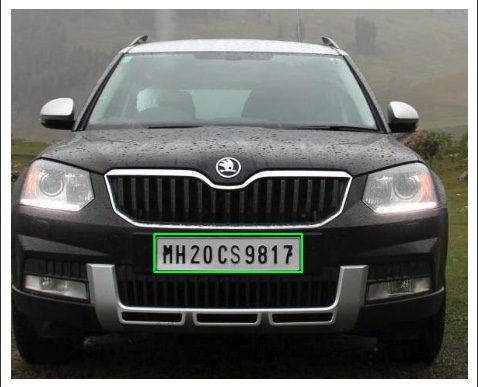
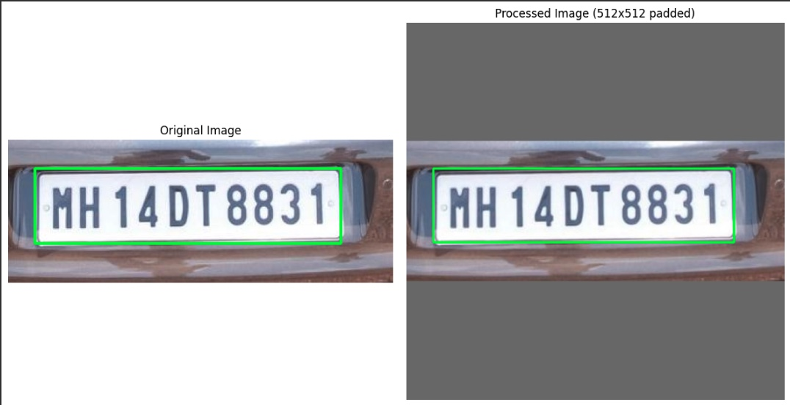
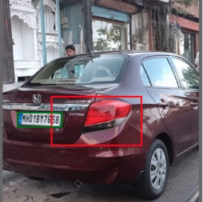
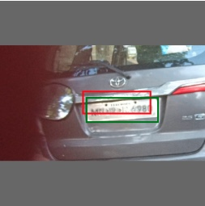
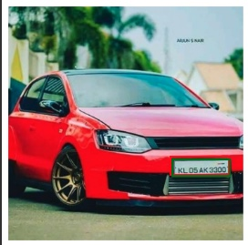

# Automating License Plate Detection with Convolutional Neural Networks and Bounding Box Regression

Author: Andrew Reusche

## Project Summary

#### Business and Data Understanding
My project aims to automate license plate detection as the first step in a computer vision based toll collection system. Currently license plates must be manually identified and cropped before being passed to OCR. My goal is to replace this manual step with a supervised learning model that can localize license plates accurately and consistently. I used the License Plate Detection dataset from Kaggle, which contains ~1,800 plate labeled vehicle images (mostly cars and vans with non-U.S. plates). These images vary in angle and distance making them well suited for training a bounding box regression model.

Data Source: "License Plate Dataset" by Ronak Gohil, Kaggle, https://www.kaggle.com/datasets/ronakgohil/license-plate-dataset

#### Data Preparation
Using PyTorch I created a custom dataset class to load YOLO formateed bounding boxes and apply image transformations. The dataset was split into training, validation, and a 10% holdout test set. I applied data augmentation (color jitter, random flipping, rotation) on the training set using torchvision.transforms, and normalized all images using ImageNet mean/std values to match ResNet expectations. My validation and test sets were only normalized to simulate real deployment conditions.

#### Modeling
I used PyTorch for modeling, testing several CNNs before moving on to a pretrained ResNet18 backbone. I explored multiple loss functions (nn.MSE, GIoU, DIoU) and ran a grid search to tune learning rate, weight decay, and dropout. My best performing model uses DIoU loss, ResNet18, and tuned hyperparameters. 

Information on Residual Network Models (ResNet18) source:
K. He, X. Zhang, S. Ren and J. Sun, "Deep Residual Learning for Image Recognition," 2016 IEEE Conference on Computer Vision and Pattern Recognition (CVPR), Las Vegas, NV, USA, 2016, pp. 770-778, doi: 10.1109/CVPR.2016.90. keywords: {Training;Degradation;Complexity theory;Image recognition;Neural networks;Visualization;Image segmentation},

PDF link: https://arxiv.org/pdf/1512.03385 

Information on Generalized Intersection over Union (GIoU) loss source:
H. Rezatofighi, N. Tsoi, J. Gwak, A. Sadeghian, I. Reid and S. Savarese, "Generalized Intersection Over Union: A Metric and a Loss for Bounding Box Regression," 2019 IEEE/CVF Conference on Computer Vision and Pattern Recognition (CVPR), Long Beach, CA, USA, 2019, pp. 658-666, doi: 10.1109/CVPR.2019.00075. keywords: {Recognition: Detection;Categorization;Retrieval;Deep Learning},

PDF Link: https://giou.stanford.edu/GIoU.pdf

Information on Distance Intersection over Union (DIoU) loss source:
Zheng, Z., Wang, P., Liu, W., Li, J., Ye, R., & Ren, D. (2020). Distance-IoU Loss: Faster and Better Learning for Bounding Box Regression. Proceedings of the AAAI Conference on Artificial Intelligence, 34(07), 12993-13000. https://doi.org/10.1609/aaai.v34i07.6999

PDF link: https://arxiv.org/pdf/1911.08287

#### Evaluation
I ran my best model on the testing holdout set to simulate the model's effectiveness on new images of vehicles that drive through the tolls and it achieved a mean IoU of 0.7475, meaning that on average, my predicted bounding boxes overlap with ~75% of the area covered by the ground truth boxes. While some imperfect predictions remain, the model should be accurate enough to replace manual plate cropping in most scenarios, greatly reducing manual effort and enabling the OCR team to operate with high confidence in the input region. 

## Business Problem
Can we use computer vision to automatically detect license plates as cars drive through toll booths?

Right now, my toll company's collection system relies on either EZ-Pass or manual toll booth workers to record and process vehicles. This approach is expensive to maintain, creates a safety risk for staff, and can slow traffic (especially during rush hour). It also leaves room for human error (misread/ cropped license plate, forgotten EZ-Pass, or a driver forgot their cash/card). 

To solve these problems and reduce operations cost, my company is building an automated toll collection pipeline powered by computer vision. The idea is to install cameras at each toll booth and use a model to detect the location of a license plate in each image as vehicles pass through (no human input required). Once the plate is located, it will be cropped and passed to and OCR (optical character recognition) system that extracts the actual license plate number. That plate number can then be matched to a database for automatic plate billing.

My team is responsible for building the first part of that computer vision pipeline: a model that can draw accurate bounding boxes around license plates. Once complete, our output will then feed directly into the next team's OCR model, minimizing error/ enabling a faster turnover/ costing less to enact/ and opening the possibility to grow the business model. 

### Metric of Success
My manager has stated that since there will always be a license plate present in the photos fed through my model, the goal of my model is not to analize if there is or is not a license plate present, but instead to predict where the plates are located in the vehicle images via bounding box regression, and the best way to train my model to do this is measure how close my license plate model predictions are to the actual (ground truth) locations of the license plates.

To evaluate this I will use a computer vision bounding box metric called Intersection over Union (IoU). IoU compares my predicted box to the ground truth box by measuring the area of overlap divided by the total area covered by both boxes. Here, the higher the IoU score the better, with a score of 1.0 meaning a perfect predicted to ground truth bounding box (license plate area) match, and a score of 0.0 meaning there was no overlap and the prediction was way off.

Because I want my model to have as accurate predictions as possible (our OCR team will be relying on these predictions to extract the plate numbers), I will use Mean IoU as my metric of success as it measures the average IoU score across all of the predictions that were made by the model.

For more information on the IoU score and how it is calculated please check out this article by Adrian Rosebrock, PhD on pyimagesearch.com: https://pyimagesearch.com/2016/11/07/intersection-over-union-iou-for-object-detection/

### Data Source and Data Use
Source: "License Plate Dataset" by Ronak Gohil, Kaggle, https://www.kaggle.com/datasets/ronakgohil/license-plate-dataset

To train and evaluate my license plate detection model I'll be using a dataset from Kaggle that contains real-world car images alongside YOLO-formatted text files with bounding box coordinates for each license plate.

This dataset contains 1,695 pictures of different sized vehicles with license plates taken from different angles/distances, and each one of those pictures is paired with its own set of bounding box coordinates to show where the vehicle's license plate is located in the picture.

From this I will use the following file directories. "images/train" and "labels/train" which I use for model training training and an internal train-test split (1,373 image/coordinate pairs to train the model). "images/val" and "labels/val" which I use as a validation set during training (159 image/coordinate pairs). "images/test" and "labels/test" which I split off from the original training set to act as a final holdout set to evaluate my final model (153 image/coordinate pairs).

Each .jpg image in the dataset comes with an associated .txt file containing one line of YOLO-style annotations detailing the ground truth license plate's object class (license_plate), and normalized bounding box values (x_center, y_center, width, height).

I will use this data to teach my CNN model where the license plate is likely to be in an image by learning from examples of where the license plates are already known to be.  

## Data Preprocessing
Once my image/label pairs were loaded using a custom PyTorch dataset class I needed to make sure my inputs were clean, consistent, and in the right format for training. The original images were in .jpg format with their labels stored in YOLO-style .txt. files using normalized (x_center, y_center, width, height) coordinates. These labels were kept as is since they already matched the format I wanted my model to predict. 

To help improve my model's ability to generalize on unseen data I applied augmentation to my training set using torchvision.transforms. This included color jittering (to simulate different light conditions), random horizontal flips (to help with symmetry), and random rotations (to simulate different angles shots from the camera input). I also normalized all images using the standard ImageNet mean and standard deviation values. This was important to match the pretrained expectations the the ResNet18 backbone I ended up using in some of my models. 

My validation and test sets were not augmented, only normalized, to simulate the real world deployment conditions, where I want the model to make clean/ unbiased predictions on new vehicle images. 

## Model Building and Data Analysis
For modeling I strarted with a few custom CNN architectures to get a feel for bounding box regression. These helped set a baseline, but my results were limited.

My big perfomance gains came from switching to transfer learning and using a pretrained ResNet18 model where I removed the classification and added a custom regression layer that outputs bounding box coordinates (normalized between 0 and 1 using sigmoid). 

I trained all my models using a custom function "train_model2()" that tracked the validation set IoU and saved the best performing weights. I tested multiple loss functions including nn.MSELoss (standard regression), GIoU (box overlap distance aware), DIoU (box overlap distance and box center distance aware). Both GIoU and DIoU loss metrics gave big bumps in performance by teaching my model to focus more on where the plates were and how well the boxes align (instead of just the raw coordinate distance of MSE).

To push my model's performance even further I ran a grid search over learning rate, dropout, and weight decay to find the best training setup. My winning combination used DIoU loss, learning rate= 0.0003, no dropout/ weight decay, and 75 epochs. This final model was able to get a mean IoU of 0.6396 on my validation set, and mean IoU of 0.7475 on my validation set, meaning that when simulated with unseen data (picture of cars with license plates) my model's predicted boxes overlapped pretty closely with the actual ground truth plate locations. 

## Conclusion
My conclusion from this analysis is that our company could successfully use computer vision and supervised learning to automate the license plate detection stage of the toll collection process. This automation could reduce the need for manual review of vehicle images, streamline toll processing, and serve as a reliable upstream component for and OCR system that extracts plate text.

In this specific case my Tuned DIoU ResNet Transfer Model is my strongest performer and could now be deployed on unseen highway traffic images to locate license plates on cars with a high degree of accuracy. My model was trained using a pretrained ResNet18 backbone for strong base features, a distance aware bounding box loss (DIoU), data normalization and augmentation for image generalization, and a tuned set of hyperparameters for peak performance.

Based on my test set evaluation I can highlight 3 key takeaways for our company:

1.   **High IoU Score Suggests Readiness for Real World Integration:** With a mean IoU of 0.7475 on the test set my model consistently generates bounding boxes that tightly match the ground truth labels pretty well. This means the license plate region is being accurately predicted in most vehicle images which would allow our OCR team to extract the plate numbers with a high confidence that they are in the "plate pictures" they are being sent to them. To counteract the lower accuracy predictions we could use multiple cameras to capture pictures and average their prediction. 
2.   **Consistent Bounding Box Placement Reduces Human Intervention:** My model shows highly consistent bounding box placement across cars of different shapes and orientations which reduces the need for human correction of boxes and could allow our system to grow. In operations, fewer incorrectly placed or oversized boxes means fewer OCR misreads/ customer disputes due to bad plate captures. This boosts our overall reliability in toll enforcement. 
3.  **Deployability Options in Automated Detection:** This model serves as the first step in our larger automated tolling pipeline so it is crucial the predictions are successful. My model accurately predicts plate locations from different target distances and angles enabling us tp place cameras at different locations instead of one narrow and strict potential field of view. This gives us more flexibility in the environments we could deploy this automation, while potentially also packing in the option for plate capture safeguard should one of the camera views be momentarily obstructed. 

## Next Steps
Here are three potential next steps that our company could take to further improve the accuracy and deployability of our license plate detection system:

1.   **Retrain on Region Specific Plate Styles and Vehicle Types:** The current model was trained entirely on non-U.S. plates and mostly featured cars and vans in the pictures. If we plan to deploy this model in a U.S. tolling environment we should retrain or fine tune the model on region-specific data that includes U.S plate formats, motorcycles, and commercial trucks. This would help the model generalize to the types of vehicles and plate designs it's most likely to encounter in the field, reducing detection error rates.
2.   **Add Tracking Component for Multi-Frame Video Inputs:** In many real world deployments vehicle data is captured in short video bursts instead of a single frame. Adding object tracking to follow the plate region across frames could increase reliability by allowing us to average predictions or choose the clearest frame for the OCR team to extract the plate number from. This would especially help combat frames that have motion blur, glare, or obstructions.
3.  **Expand to Multi-Plate Scenarios:** As we scale we may encounter images with multiple vehicles or stacked plates. Updating the model to handle multiple bounding boxes per image would make our system more flexible and more robust across different toll lanes. For example one camera may be able to pick up the plates of two different lanes instead of just one camera per lane.

## Repository Links

PowerPoint presentation *replace link*

Notebook PDF 

Project Notebook

## Repository Layout *update layout accordingly*
1) Pictures
2) GitIgnore File
3) Notebook PDF
4) Project Notebook
5) Project PowerPoint Presentation
6) README file